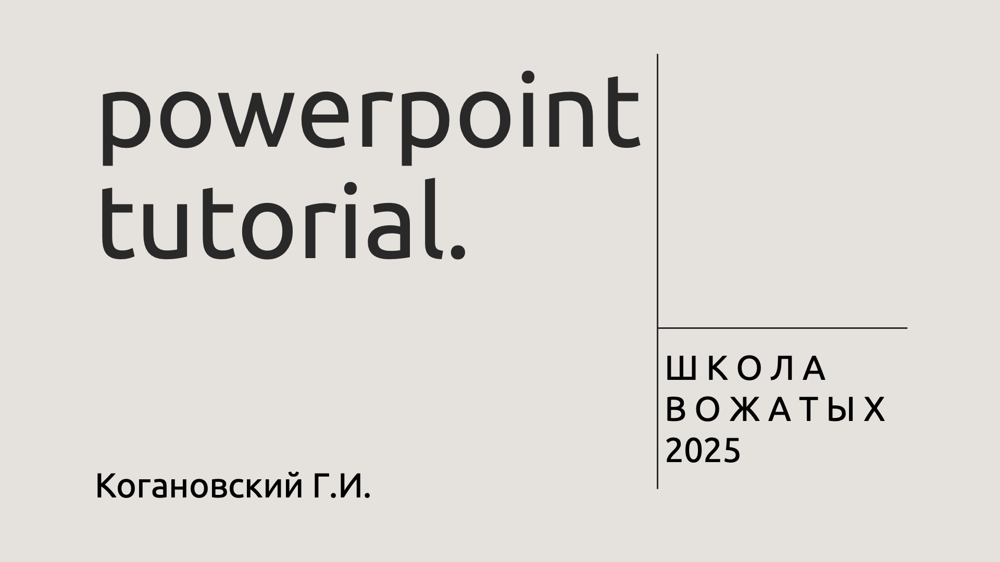

# powerpoint-tutorial

В последний день августовских сборов каждый класс выступает со своей сценкой. Практика показала, что самый простой, универсальный и надежный способ сопроводить выступление картинками, звуками и видео — презентация в PowerPoint.

Этот туториал поможет вам, вожатым, быстро создать функциональную и надежную презентацию для выступления вашего класса.

  

